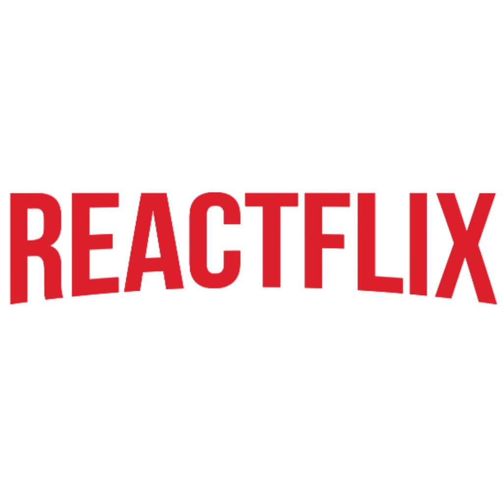

  
  <h3 align="center">Reactflix: Guía de series y películas</h3>

---

Aplicación para consultar series y películas desarrollada en React Native, haciendo uso de la api provista por The Movie Database (TMDb). Además, esta aplicación requiere de [reactflix-backend](https://github.com/verzi/reactflix-backend), un backend desarrollado utilizando Node.js, Express.js y MongoDB Atlas.

## APIs

- [TMDb](https://developers.themoviedb.org/3/getting-started/introduction)

## Expo

Este proyecto ha sido desarrollado utilizando [Expo](https://expo.io/).

## Contribución

Cualquier reporte de bug, solicitud de mejora o cualquier otra contribución es bienvenida!  

Siempre que sea posible, realice un pull request con la implementación en lugar de simplemente solicitarla.

Si la mejora es grande, abra primero un tema para discusión.

### Ejecución local

#### Requerimientos

- [Node.js](https://nodejs.org/) (latest)
- [Expo](https://expo.io/) (latest)
- [Yarn](https://yarnpkg.com/)

#### ¿Cómo tengo que hacer?

- `git clone git@github.com:verzi/reactflix.git`
- `yarn install`

Para iniciar el proyecto, elegir una de las siguientes opciones:

- `yarn android`
- `yarn ios`
- `yarn start`

## Licencia

MIT License: ([Licencia](./LICENSE.md)).
